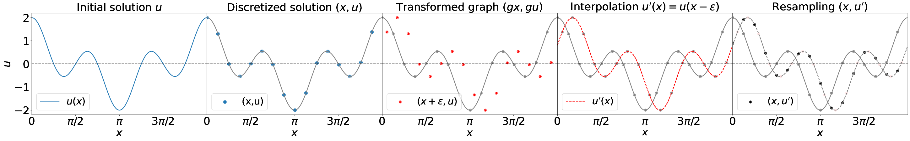
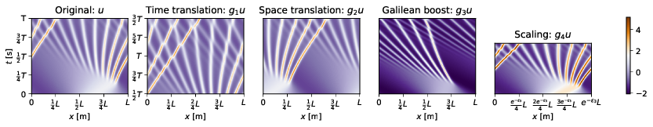
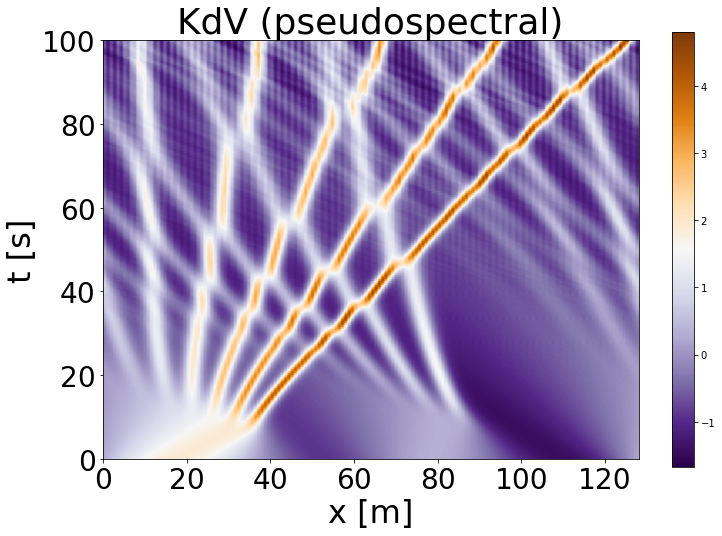
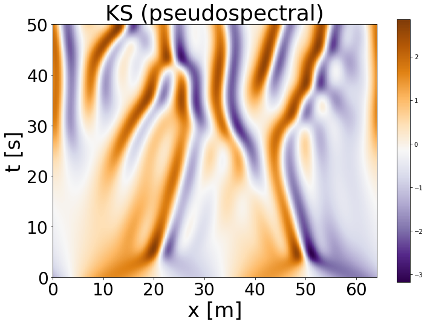

# Lie Point Symmetry Data Augmentation for Neural PDE Solvers

Johannes Brandstetter, Max Welling, Daniel Worrall

<a href="https://arxiv.org/abs/2202.07643">Link to the paper</a>

If you find our work and/or our code useful, please cite us via:
```bibtex
@article{brandstetter2022lie,
  title={Lie Point Symmetry Data Augmentation for Neural PDE Solvers},
  author={Brandstetter, Johannes and Welling, Max and Worrall, Daniel E},
  journal={arXiv preprint arXiv:2202.07643},
  year={2022}
}
```





### Set up conda environment

source environment.sh

### Notebooks

Have a look into our jupyter notebooks to get an idea how we do the data generation and how we apply Lie point symmetry data augmentation.

### Produce datasets for Korteweg-de Vries (KdV) equation 
`python generate/generate_data.py --experiment=KdV --train_samples=512 --valid_samples=512 --test_samples=512 --L=128`



### Produce easier datasets for Korteweg-de Vries (KdV) equation
We used easier datasets for training the Resnet or the CNN model since these models do not have the same complexity as the FNO model and thus have a harder time fitting the default KdV equation.

`python generate/generate_data.py --experiment=KdV --train_samples=512 --valid_samples=512 --test_samples=512 --L=128 --end_time=50. --suffix=easy`

### Produce datasets for Kuramoto-Shivashinsky (KS) equation



`python generate/generate_data.py --experiment=KS --train_samples=512 --valid_samples=512 --test_samples=512 --L=64 --nt=500`

### Produce datasets for Burgers' equation

Trajectories are generated for the Heat equation and then transformed via the Cole-Hopf transformation into the Burgers' equation.
The `L` parameter is automatically set to `2*math.pi`.


`python generate/generate_data.py --experiment=Burgers --train_samples=512 --valid_samples=512 --test_samples=512 --end_time=18. --nt=180`

###  Train PDE solvers for KdV equation

KdV augmentation is controlled via [time translation (bool), space translation (max_x_shift), Galilean translation (max_velocity), scale (max_scaling)]
Setting any of these values to zero corresponds to switching off the augmentation.

`CUDA_VISIBLE_DEVICES=0 python experiments/train.py --device=cuda:0 --experiment=KdV --KdV_augmentation=1,1.0,0.4,0.1 --train_samples=512`

###  Train PDE solvers for KS equation

KS augmentation is controlled via [time translation (bool), space translation (max_x_shift), Galilean translation (max_velocity)]
Setting any of these values to zero corresponds to switching off the augmentation.

`CUDA_VISIBLE_DEVICES=0 python experiments/train.py --device=cuda:0 --experiment=Burgers --KS_augmentation=1,1.0,0.4 --train_samples=512`

###  Train PDE solvers for Burgers equation

Burgers augmentation is controlled via [time translation (bool), space translation (max_x_shift), mixing parameter]
Setting any of these values to zero corresponds to switching off the augmentation.
The mixing parameter determines to which extend different trajectories are mixed to generate a new trajectory. 

`CUDA_VISIBLE_DEVICES=0 python experiments/train.py --device=cuda:0 --experiment=KS --Burgers_augmentation=1,1.0,0.5 --train_samples=512`